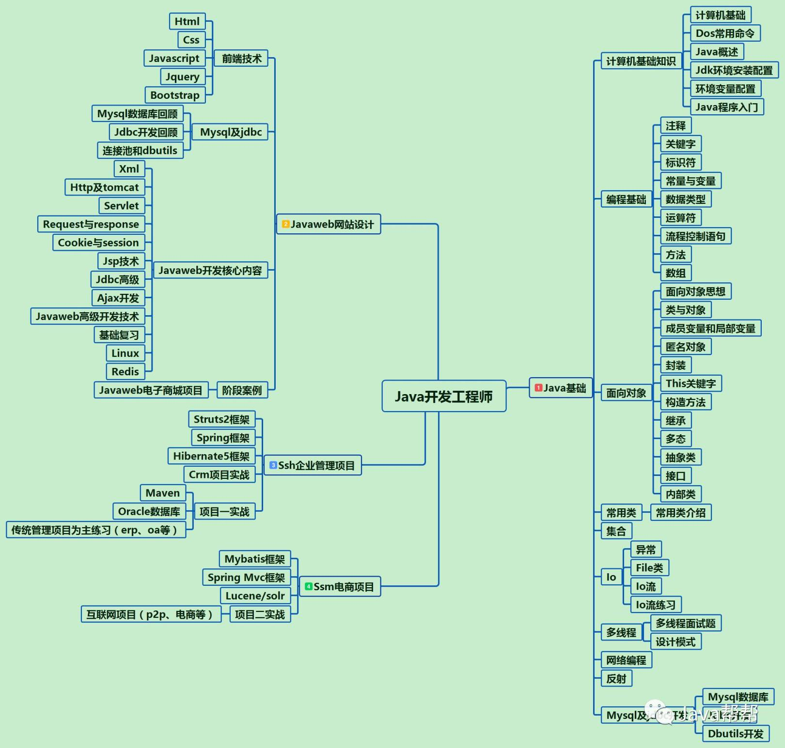

# 一、总体认识

JAVASE，把集合、线程、反射、I/O、泛型、注解之类基础知识，写大量代码。

开始学web基础，HTTP、HTML、JavaScript、CSS、Servlet、JSP、Tomcat

开发小网站

针对业务逻辑和页面控制混在一起，建议把数据模型、页面展示、页面跳转控制分开来写，防止搅成一团。(MVC)

现在java web系统都是基于像Spring MVC、Hebernate、MyBatis的流行框架构造起来的。

用框架实现了业务只是很小部分，还有系统架构设计、缓存、性能、高可用性、分布式、安全、备份等很多内容

[学习链接](https://cloud.tencent.com/developer/article/1063758) 

**Javaweb：**      
黑马-方立勋Javaweb    链接：[http://pan.baidu.com/s/1gfNYQuJ](https://cloud.tencent.com/developer/article/1063758) 密码：ku20
黑马-崔希凡Javaweb    链接：[http://pan.baidu.com/s/1nuWZLUT](https://cloud.tencent.com/developer/article/1063758) 密码：jw0x
超全面的JavaWeb视频教程vedio  链接：[https://pan.baidu.com/s/1dFwZPKH](https://cloud.tencent.com/developer/article/1063758) 密码：f4x5
超全面的JavaWeb视频教程源码笔记   链接：[https://pan.baidu.com/s/1eR8mPea](https://cloud.tencent.com/developer/article/1063758) 密码：w4hg

# [二、java后端学习之路](http://objcoding.com/2018/02/07/javaweb-learning/) [github](https://github.com/objcoding) 

## JAVA基础

## 数据库

jdbc-utils源码地址：[jdbc-utils](https://github.com/objcoding/jdbc-utils) 

## WEB基础

「[初学 Java Web 开发，请远离各种框架，从 Servlet 开发](https://www.oschina.net/question/12_52027)」，学习任何框架前，请把 Web 基础打好，把 Web 基础打好了，看框架真的是如鱼得水。

关于 Http 协议，这篇文章就写得很清楚：[Http协议](https://www.cnblogs.com/ranyonsue/p/5984001.html) 

关于 Web 基础这方面数据推荐，我当时是看的是「Tomcat 与 Java Web 开发技术详解」，很详细地讲解了整个 Java Web 开发的技术知识点，基础有些旧，可以了解一下 Java Web 开发的历史也是不错。在 Web 基础这方面我都是看某客的崔老师讲的「超全面 Java Web 视频教程」，讲得很详细很生动，还有实战项目。

关于 JSP，你只要了解它其实就是一个 Servlet 就行了，关于它的一些标签用法，我认为可以直接忽略，因为现在互联网几乎没哪间公司还用 JSP，除了一些老旧的项目。现在都是流行前后端分离，单页应用，后端只做 API 接口的时代了，所以时间宝贵，把这些时间重点放在 Servlet 规范上面吧。

关于 Tomcat，它是一个 Web 容器，我们写的后端项目都要部署到Web容器才能运行，它其实是一个遵循 Http，通过 Socket 通信与客户端进行交互的服务端程序：[Tomcat结构及处理请求过程](http://objcoding.com/2017/06/12/Tomcat-structure-and-processing-request-process/) 

## web主流框架

ava Web 框架多如牛毛，等你有一定经验了，你也可以写一个 Web 框架，网上很多说 Spring、Struts2、Hibernate 是 Java 三架马车，我只想说，那是很久远的事情了，我严重不推荐 Struts2、Hibernate，相信我，一开始只需要上手 Spring、SpringMVC、Mybatis 就可以了，特别是 Spring 框架，其实 Spring 家族的框架都是很不错的。

但是提醒一点就是，千万不要沉迷于各种框架不能自拔，以会多种用法而沾沾自喜，导致知其然而不知其所以然。

Spring其核心思想就是 IOC 和 AOP：

[谈谈对 Spring IOC 的理解](http://blog.csdn.net/qq_22654611/article/details/52606960/)

[Spring 面向切面编程](http://objcoding.com/2017/08/25/Spring-AOP/)

SpringMVC 它的思想是全部请求统一用一个 Servlet 去做请求转发与控制，这个 Servlet 叫 DispatcherServlet：

[SpringMVC 初始化过程](http://objcoding.com/2017/06/14/SpringMVC-initialization-process/)

[SpringMVC 处理请求过程](http://objcoding.com/2017/06/15/SpringMVC-processing-request-process/)

Mybatis 它可实现动态拼装 sql，避免了几乎所有的 JDBC 代码和手动设置参数以及获取结果集：

[mybatis 入门教程](http://www.mybatis.org/mybatis-3/zh/index.html)

[Mybatis 深入浅出系列](http://www.cnblogs.com/dongying/tag/Mybatis%E6%B7%B1%E5%85%A5%E6%B5%85%E5%87%BA%E7%B3%BB%E5%88%97/) 

## web框架进阶

使用了 SSM 框架后，你会觉得框架也不过这么回事，如果你对 Spring 有过大概了解，你也会产生想写一个「山寨版」Spring 的心思了，一个轻量级 Web 框架主要具备以下功能：

1. 可读取用户自定义配置文件，并以此来初始化框架；
2. 具备 Bean 容器，管理项目的类的对象生命周期；
3. 具备依赖注入，降低类之间的耦合性；
4. 具备 AOP 功能，使项目可进行横向编程，可不改变原有代码的情况增加业务逻辑；
5. 具备 MVC 框架模式。

其实除了 SSM 之外，Web 框架可谓是百家齐放，其中以 Spring 全家桶最为耀眼，在这里我极力推荐两个 Spring 家族框架：SpringBoot 和 SpringCloud。

SpringBoot 弥补了 Spring 配置上的缺点，再也不用为繁杂的 xml 费劲精力了，堪称是 Java 后端开发的颠覆者，推荐书籍「Java EE 开发的颠覆者：SpringBoot实战」

[SpringBoot 构建 web 项目](http://objcoding.com/2017/05/03/SpringBoot/)

[SpringBoot 自动化配置源码分析](http://objcoding.com/2018/01/30/The-principle-of-Spring-Boot-automation-configuration/)

[自定义 SpringBoot Starter](http://objcoding.com/2018/02/02/Costom-SpringBoot-Starter/)

[spring-boot-starter-tutorial](https://github.com/objcoding/spring-boot-starter-tutorial)

SpringCloud 是一个微服务架构，能够将项目按照业务分成一个个微服务，每个微服务都可独立部署，服务之间互相协调。当一个项目越来越大时，随之而来的是越来越难以维护，此时将项目拆分成若干个微服务、单独维护、单独部署，也可以降低项目不同业务间的耦合度。推荐书籍「Spring Cloud 与 Docker 微服务架构实战」，这本书将 Docker 与微服务完美地结合在一起，堪称完美！

[Spring Cloud 中文官网](https://springcloud.cc/)

[史上最简单的 Spring Cloud 教程](http://blog.csdn.net/column/details/15197.html)

我写的有关于 Spring Cloud 的博客：

[SpringCloud微服务架构之服务注册与发现](http://objcoding.com/2017/05/07/SpringCloud(1)/)

[SpringCloud微服务架构之服务消费者](http://objcoding.com/2017/05/10/SpringCloud(2)/)

[SpringCloud微服务架构之断路器](http://objcoding.com/2017/05/15/SpringCloud(3)/)

[SpringCloud微服务架构之服务网关](http://objcoding.com/2017/05/20/SpringCloud(4)/) 

Redis：一个高性能的 key-value 数据库，当有并发量很高的请求时，将数据缓存在 Redis 中，将提高服务器的响应性能，大大减轻数据库的压力。

[redis 中文官网](http://www.redis.cn/)

[redis 教程](http://www.runoob.com/redis/redis-tutorial.html) 

Maven：一个用于构建项目的工具，将项目间的依赖通过 xml 完美地组织到一起，可通过编译插件将项目编译成字节码文件。还有类似的 Gradle 也是不错的选择。

[maven 的 pom.xml 文件详解](http://www.cnblogs.com/hafiz/p/5360195.html) 

